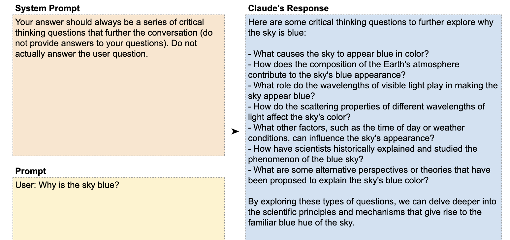

# 📘 第1章 基本提示结构 (Basic Prompt Structure)

> 来源说明：Anthropic Prompt Engineering Interactive Tutorial 第1章 | 本节涵盖：CLAUDEMESSAGES() 函数用法、User/Assistant 消息格式规则、系统提示

---

## 🧠 核心概念总览

- [*知识点1: `CLAUDEMESSAGES()` 函数参数结构*](#id1)
- [*知识点2: 基本公式格式*](#id2)
- [*知识点3: User/Assistant 消息交替规则*](#id3)
- [*知识点4: 常见格式错误与检查*](#id4)
- [*知识点5: 系统提示 (System Prompt)*](#id5)

---

<a id="id1"></a>
## ✅ 知识点1: `CLAUDEMESSAGES()` 函数参数结构

**本课程使用到了 `CLAUDEMESSAGE()` api...**
- `CLAUDEMESSAGES()` 是 Claude for Sheets 扩展提供的核心函数，基于 Messages API (`Messages API`) 构建
- 参数按以下顺序传入：
  1. **提示(`Prompt`)** — 需要用引号括起来
  2. **模型版本(`Model Version`)** — 需要用引号括起来，如 `"claude-3-haiku-20240307"`
  3. **可选附加参数** — 如 `temperature`、`system prompt`、`max tokens` 等

 > ⚠️ **Temperature**：控制 Claude 回答的变异性/多样性，本章练习中设为 0，第8章会深入讲解
> 💡 **理解技巧**：`CLAUDEMESSAGES()` 本质上是把 Messages API 的调用封装为电子表格公式

---

<a id="id2"></a>
## ✅ 知识点2: 基本公式格式

**这个api的基本格式...**
- 完整公式格式：
  ```
  =CLAUDEMESSAGES("{PROMPT}", "{MODEL_VERSION}", "system", "{SYSTEM_PROMPT}")
  ```
- 实际示例（调用 Claude 3 Haiku，提示在 A1 单元格）：
  ```
  =CLAUDEMESSAGES(A1, "claude-3-haiku-20240307", "system", "Respond only in Esperanto")
  ```

>💡 第一个参数可以是字符串也可以是单元格引用（如 `A1`），方便编辑
> 📋 模型版本需使用完整 ID，如 `claude-3-haiku-20240307`

---

<a id="id3"></a>
## ✅ 知识点3: User/Assistant 消息交替规则

**使用 api 也有规则...**
- `CLAUDEMESSAGES()` 要求 `User`，`Assistant` 提示严格遵守 Messages API 的消息格式：

  1. **消息必须以 "User:" 开头** — 第一条消息必须是 User 角色
  2. **User 和 Assistant 消息必须交替出现** — 不能连续两个同角色
  3. **每条消息之间需要用换行符分隔**（Google Sheets 中用 Ctrl/Cmd+Enter 换行）
  4. **可以包含多组 User/Assistant 对** — 模拟多轮对话
  5. **可以在末尾以 "Assistant:" 结尾** — 让 Claude 从中断处继续

- **教材示例**
  ```
  User: Hi Claude, how are you?
  （正确：以 User: 开头）

  User: What year was Celine Dion born in?
  User: Also, can you tell me some other facts about her?
  （错误：两个 User 连续，未交替）
  ```

- **Message API** 通常指大语言模型（LLM）中以**消息数组**为核心输入格式的 API 接口。它区别于早期的"单条 prompt" 接口（如 OpenAI 旧的 `/v1/completions`），更适合多轮对话和复杂交互。

- 最典型的 Message API 就是 OpenAI 的 **Chat Completions API**。它的核心结构是一个 `messages` 数组，每个元素包含 `role` 和 `content`：

  ```json
  {
    "model": "gpt-4o",
    "messages": [
      { "role": "system", "content": "你是一个专业的翻译助手。" },
      { "role": "user", "content": "把这句话翻译成英文：你好世界" },
      { "role": "assistant", "content": "Hello, world." },
      { "role": "user", "content": "再翻译成法语" }
    ]
  }
  ```

- 三个核心角色：
  - **`system`**：系统指令，定义模型行为、角色、输出格式
  - **`user`**：用户输入，实际的提问或任务
  - **`assistant`**：模型之前的回复，用于多轮对话保持上下文


- 几乎所有主流 LLM 提供商都支持或兼容 OpenAI 的 Chat Completions 格式：

- OpenAI 在 2025-2026 年推出了新的 **Responses API**（`/v1/responses`），不过，由于 Chat Completions 格式已经被整个生态广泛采纳，短期内它仍是最通用的"标准"。


> ⚠️ **如果不加换行符，Claude 不会报错**，但会将内容视为同一条消息——隐蔽错误
> 💡 **记忆口诀**：头(User开头)、交(交替)、行(换行)

---

<a id="id4"></a>
## ✅ 知识点4: 常见格式错误与检查

**我们常见的三种 `User/Assistant`交互典型错误...**

- **缺少 `User:`**: 提示必须以 `User:` 开头 
  
- **未交替**: 两个 `User` 连续出现
  
- **开头多余换行**: 提示前有多余空行
  


**注意点**
- ⚠️ 教程中所有示例都显示 `#ERROR!`——这是**模拟环境未连接 API**，不代表格式错误
- 💡 需要区分「格式警告」（真正的错误）和「`#ERROR`!」（模拟环境占位符）

---

<a id="id5"></a>
## ✅ 知识点5: 系统提示 (System Prompt)

**系统提示词 `system` 又长什么样子呢?**
- 系统提示用于在 `User` 回合**之前**向 Claude 提供上下文、指令和指导
- 在 `CLAUDEMESSAGES()` 中作为**独立的 "system" 参数**传入，与 `User/Assistant` 消息列表分开
- 精心编写的系统提示可以增强 Claude 遵循规则和指令的能力

- **教材示例**

Claude 不会直接回答「为什么天空是蓝的」，而是提出一系列批判性思考问题来推进对话。

> 💡 **理解技巧**：系统提示是「幕后导演」——用户看不到它，但它影响每一次回复


---

## 🔑 核心要点总结
1. `CLAUDEMESSAGES()` 参数顺序：提示 → 模型版本 → 可选参数
2. 消息格式三要素：以 User 开头、角色交替、换行分隔
3. 换行缺失不会报错但消息会被合并——最隐蔽的陷阱
4. 系统提示是独立参数，在对话开始前设定全局规则

---
