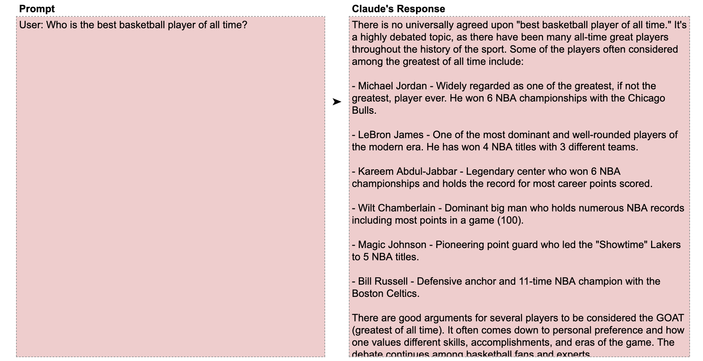
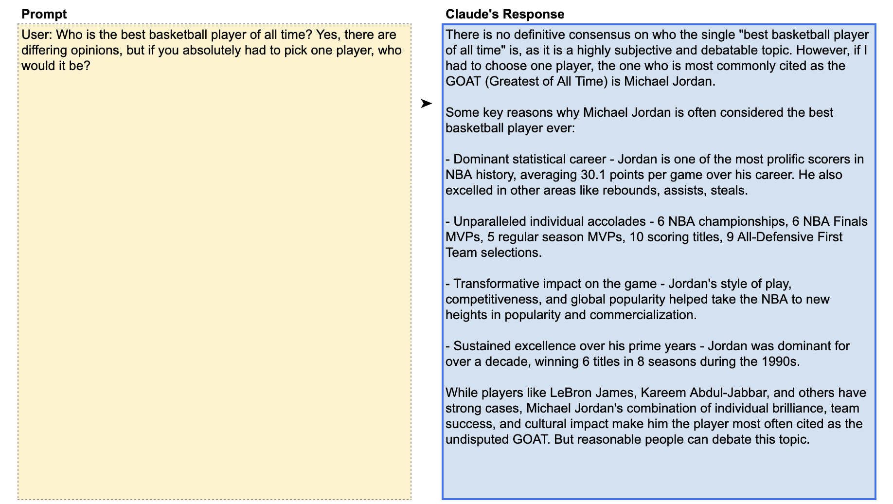

# 📘 第2章 清晰直接地表达 (Being Clear and Direct)

> 来源说明：Anthropic Prompt Engineering Interactive Tutorial 第2章 | 本节涵盖：清晰直接提示的核心原则、跳过前导语、强制确定性回答

---

## 🧠 核心概念总览

- [*知识点1: 清晰直接指令的核心原则*](#id1)
- [*知识点2: 黄金法则——用同事测试你的提示*](#id2)
- [*知识点3: 强制确定答案——篮球GOAT示例*](#id4)

---

## ✅ 知识点1: 清晰直接指令的核心原则

**大模型有个特点...**
- Claude 对清晰、直接的指令(`clear and direct instructions`)反应最好
- Claude 就像 **刚入职的新员工** ——必须被明确告知要做什么，不能假设它会自己猜出来
- 如果指令模糊，Claude 会像人一样给出泛泛而谈的错误回答
- **这不是模型能力问题，而是提示设计问题**

---

## ✅ 知识点2: 黄金法则——用同事测试你的提示

**因此，根据以上，我们提出...**
- 教程提出「清晰提示的黄金法则」（`Golden Rule of Clear Prompting`）：

    > **把你的提示给同事或朋友看，让他们根据提示执行任务。如果他们感到困惑，Claude 很可能也会困惑。**

- 这是最实用的自查方法——人的困惑 = 模型的困惑
- 不需要任何技术背景就能验证提示的清晰度

---

## ✅ 知识点3: 强制确定答案——篮球GOAT示例

**我们来看一个例子**
- **模糊版 Claude 列举多位候选人，不给出明确答**：
    

- **明确版  Claude 可以作出自己的决定**：
    

- Claude 默认在争议性问题上保持中立
- 如果确实需要一个确定答案，必须明确要求——"即使有争议，你必须选一个"

> 💡 "if you absolutely had to pick one" 相当于给 Claude 一个「允许」——我知道有争议，但我需要你选一个
> ⚠️ 强制选择会牺牲客观性，只适用于需要决策/推荐的场景

---

## 🔑 核心要点总结
1. Claude 不会读心——清晰直接的指令是好结果的必要条件
2. 黄金法则：同事能理解的提示，Claude 才能理解
3. 不需要的前导语可以通过直接要求来消除
4. 争议问题需要明确告诉 Claude 「必须选一个」，否则它会保持中立

---