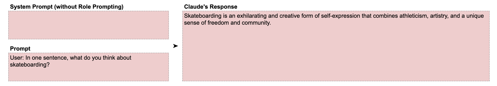
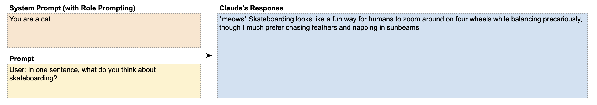
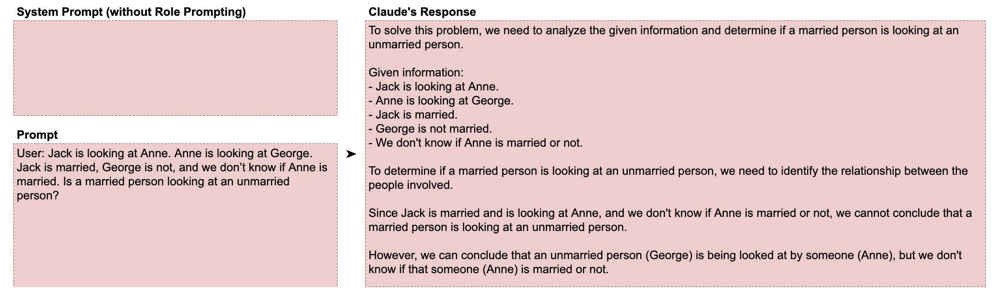
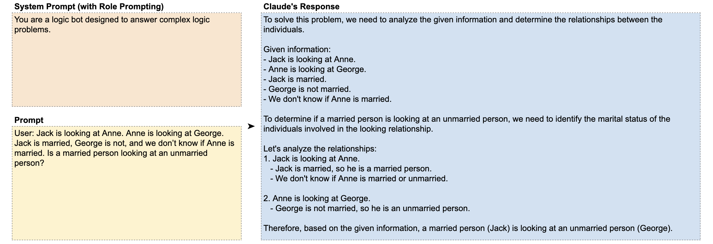

# 📘 第3章 角色分配 (Assigning Roles / Role Prompting)

> 来源说明：Anthropic Prompt Engineering Interactive Tutorial 第3章 | 本节涵盖：角色提示技术、系统提示中的角色设定、角色对推理能力的增强

---

## 🧠 核心概念总览

- [*知识点1: 角色提示的核心原理*](#id1)
- [*知识点2: 角色改变语气与视角——滑板示例*](#id2)
- [*知识点3: 角色增强逻辑推理——逻辑题示例*](#id3)

---

## ✅ 知识点1: 角色提示的核心原理

**大模型有个特点...**
- Claude 除了用户输入的内容外**没有其他上下文**，因此有时需要告诉它扮演特定角色并提供背景信息
- 这种行为称为**角色提示**(`Role Prompting`)，角色描述越详细越好
- 设定角色可以提升 Claude 在写作、编程、摘要等**多领域**的表现
- 角色提示可以设置在系统提示中，也可以作为用户消息的一部分
- 类比：人被要求 **"think like a ___"** 时会表现不同，Claude 也一样——角色能改变回应的**风格、语气和方式**

> 💡 **理解技巧**：给 Claude 一个角色，相当于给它戴上一副「专业眼镜」——它看问题的角度会变
> 📋 **术语提醒**：`Role Prompting(角色提示)` = 通过角色设定引导模型行为

---

## ✅ 知识点2: 角色改变语气与视角——滑板示例

**举个例子帮你理解...**

- **无角色提示词：直接、无风格化的回答** 
    
- **有角色提示词：语气、风格、视角完全改变**
    

- 教程还指出可以加上受众信息：**你是一只正在对一群滑板爱好者说话的猫**会产生完全不同的回答
- 角色提示还可以用于：模仿特定写作风格、以某种口吻说话、引导回答的复杂程度

> **理解技巧**：角色 = 身份 + 受众 + 场景，三个维度越具体效果越好

---

## ✅ 知识点3: 角色提示词增强逻辑推理——逻辑题示例

**角色提示词带来的帮助还在很多方面...**

- 给 AI 分配特定角色，以引导其输出风格、语气与回答深度。
    **作用**
    - **风格控制**：模仿特定写作风格
    - **语气调节**：改变回答的口吻（如专业、幽默、学术）
    - **复杂度引导**：控制回答的详细程度
    - **能力提升**：改善数学与逻辑任务的表现
- **教材示例**

    - **无角色提示时**：正确答案为 "Yes"，但 Claude 错误认为缺少信息而答错
        
    - **有角色提示时**：Claude 答对了（尽管不是所有推理步骤都完全正确）
        

    - 正确答案是 **Yes**（如果 Anne 已婚，Jack(已婚)→ Anne(已婚看未婚George)=Yes；如果 Anne 未婚，Jack(已婚看未婚Anne)=Yes，无论如何都是 Yes）

> 🔄 **知识关联**：第6章（逐步思考）会进一步展示如何通过分步推理来提升这类逻辑题的准确率
> ⚠️ **关键区分**：角色提示增强了推理能力，但不保证每一步都完美——它改变的是 Claude 对待问题的「态度」

---

## 🔑 核心要点总结
1. 角色提示 = 给 Claude 设定身份、视角和行为约束
2. 角色可以放在系统提示或用户消息中，越具体效果越好
3. 相同的提示 + 不同的角色 = 完全不同的输出风格和准确率
4. 角色提示甚至可以提升数学/逻辑任务的表现

---
