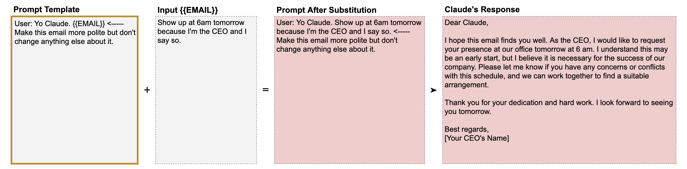
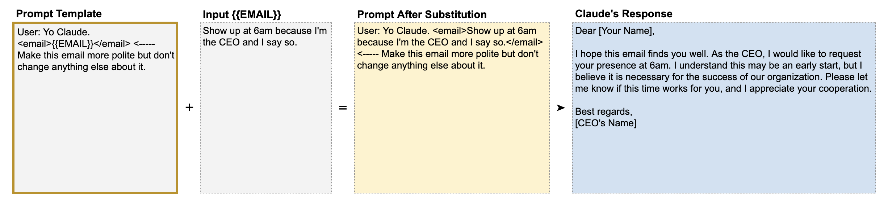

# 📘 第4章 数据与指令分离 (Separating Data and Instructions)

> 来源说明：Anthropic Prompt Engineering Interactive Tutorial 第4章 | 本节涵盖：提示模板、占位符变量、XML 标签分隔、边界问题

---

## 🧠 核心概念总览

- [*知识点1: 提示模板与变量替换*](#id1)
- [*知识点2: 变量边界不清晰的问题*](#id2)
- [*知识点3: XML 标签解决方案*](#id3)
- [*知识点4: 细节决定成败*](#id4)

---

## ✅ 知识点1: 提示模板与变量替换

**传统提示词的问题...**
- 很多时候，我们并不想写完整的提示，而是想要**提示模板**
   - 这些模板可以在提交给 Claude 之前，通过额外的输入数据进行修改
   - 如果你希望 Claude 每次都做同样的事情，但任务所用的数据每次可能不同，这就派上用场了

- **提示模板**(`Prompt Template`)：
    - 变量用 `{{双花括号}}` 包裹，命名应**具体且相关**（如 `{{ANIMAL}}` 而非 `{{X}}`）
- **做法**：将提示的**固定骨架**与**可变用户输入**分离，在发送前替换变量
   > 📋 术语提醒：`Prompt Template(提示模板)` = 固定结构 + 可替换变量
- 我们为什么要像这样分离和替换输入呢？因为**提示模板简化了重复性任务**。

    >**⚠️ 注意：** 提示模板可以根据需要包含**任意数量的变量**。

- **教材示例**
       
    - 假设你构建了一个提示结构，让第三方用户向其中提交内容（本例中就是他们想要生成叫声的动物）。这些第三方用户不必编写甚至不必看到完整的提示，他们所要做的就是**填写变量**。

> 💡 模板让第三方用户只需填写变量，无需查看完整提示——适合产品化

---

## ✅ 知识点2: 变量边界不清晰的问题

**提示词模版有一个问题...**

- 像这样引入替换变量时，非常重要的是**确保 Claude 知道变量从哪里开始、到哪里结束**（与指令或任务描述区分开）。
- 反面案例：
    

- Claude 将 "Yo Claude" 当作邮件正文的一部分，改写后以 "Yo Claude" 变为 "Dear Claude" 
- **问题根源**：没有明确分隔指令与变量，Claude 分不清哪部分是输入数据，哪部分是指令

---

## ✅ 知识点3: XML 标签解决方案

**如何解决这个问题呢?**
- **核心方法**：用 XML 标签包裹用户输入数据
- Claude 已经经过训练能识别 XML 标签作为提示组织机制
    > ⚠️**注意：** 虽然 Claude 能够识别并处理多种分隔符和定界符，但我们建议专门使用 **XML 标签**作为 Claude 的分隔符，因为 Claude 在训练中被专门设计为将 XML 标签识别为一种**提示组织机制**。在函数调用之外，并不存在什么"独门秘籍"式的 XML 标签——Claude 也没有接受过专门训练去使用某些特定标签来最大化提升你的效果。我们特意让 Claude 在这方面保持高度的**可塑性和可定制性**。
- XML 标签成对出现：`<tag>内容</tag>`
- 用标签明确标记数据的**起始和结束位置**

- **教材示例**
       

- 现在 Claude 能正确区分指令和数据了。
    - 无 XML：Claude 错误将 "Each is about an animal, like rabbits." 当作列表第一项
    - 有 XML：`<sentences>{{SENTENCES}}</sentences>` → Claude 正确识别所有列表项

>💡 **理解技巧**：XML 标签 = 给 Claude 画边界线——「从这里开始是数据，到这里结束」

---

## ✅ 知识点4: 细节决定成败

**细节决定成败...** 
- 一个重要原则：
    - 教程在错误示例中**故意保留了连字符**来引发错误
    - 提示中的拼写和语法错误会影响 Claude 的表现——Claude 对模式敏感，**你越「聪明」它越聪明，你越「随意」它越随意**

---

## 🔑 核心要点总结
1. 使用 `{{变量}}` 双花括号创建可复用的提示模板
2. 变量边界不清时 Claude 会混淆指令和数据——**必须用 XML 标签分隔**
3. XML 标签成对使用：`<tag>{{VARIABLE}}</tag>`
4. 小细节影响大结果：拼写错误、语法问题都会降低输出质量

---
