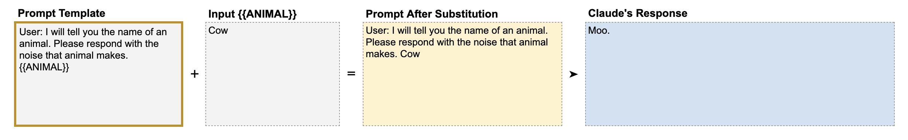

# 📘 第4章 数据与指令分离 (Separating Data and Instructions)

> 来源说明：Anthropic Prompt Engineering Interactive Tutorial 第4章 | 本节涵盖：提示模板、占位符变量、XML 标签分隔、边界问题

---

## 🧠 核心概念总览

- [*知识点1: 提示模板与变量替换*](#id1)
- [*知识点2: 变量边界不清晰的问题*](#id2)
- [*知识点3: XML 标签解决方案*](#id3)
- [*知识点4: 细节决定成败*](#id4)

---

<a id="id1"></a>
## ✅ 知识点1: 提示模板与变量替换

**传统提示词的问题...**
- 很多时候，我们并不想写完整的提示，而是想要**提示模板**
   - 这些模板可以在提交给 Claude 之前，通过额外的输入数据进行修改
   - 如果你希望 Claude 每次都做同样的事情，但任务所用的数据每次可能不同，这就派上用场了

- **提示模板**(`Prompt Template`)：变量用 `{{双花括号}}` 包裹，命名应**具体且相关**（如 `{{ANIMAL}}` 而非 `{{X}}`）
- 做法：将提示的**固定骨架**与**可变用户输入**分离，在发送前替换变量
> 📋 术语提醒：`Prompt Template(提示模板)` = 固定结构 + 可替换变量


- **教材示例**
       


> 💡 模板让第三方用户只需填写变量，无需查看完整提示——适合产品化

---

<a id="id2"></a>
## ✅ 知识点2: 变量边界不清晰的问题

**理论**
教程展示了一个反面案例：

```
模板: "User: Yo Claude. {{EMAIL}} <----- Make this email more polite 
       but don't change anything else about it."
输入: "Show up at 6am tomorrow because I'm the CEO and I say so."
```

- Claude 将 "Yo Claude" 当作邮件正文的一部分，改写后以 "Dear Claude" 开头
- **问题根源**：没有明确分隔指令与变量，Claude 分不清哪部分是输入数据，哪部分是指令

**注意点**
- ⚠️ **关键区分**：`Yo Claude` 是给 Claude 的招呼语，但因为没有分隔符，Claude 认为这是要改写的邮件内容
- 💡 **理解技巧**：想象你给一个人两张纸条——一张是指令，一张是数据。如果不标记清楚，对方会搞混

---

<a id="id3"></a>
## ✅ 知识点3: XML 标签解决方案

**理论**
- **核心方法**：用 XML 标签包裹用户输入数据
- Claude 经过训练能识别 XML 标签作为提示组织机制
- XML 标签成对出现：`<tag>内容</tag>`
- 用标签明确标记数据的**起始和结束位置**

**教材示例——邮件改写修正版**
```
模板: "User: Yo Claude. <email>{{EMAIL}}</email> <----- Make this email 
       more polite but don't change anything else about it."
输入: "Show up at 6am tomorrow because I'm the CEO and I say so."
替换后: "User: Yo Claude. <email>Show up at 6am tomorrow because I'm the 
        CEO and I say so.</email> <----- Make this email more polite..."
```
现在 Claude 能正确区分指令和数据了。

**教材示例——列表分类修正版**
- 无 XML：Claude 错误将 "Each is about an animal, like rabbits." 当作列表第一项
- 有 XML：`<sentences>{{SENTENCES}}</sentences>` → Claude 正确识别所有列表项

**注意点**
- 💡 **理解技巧**：XML 标签 = 给 Claude 画边界线——「从这里开始是数据，到这里结束」
- 🔄 **知识关联**：第5章会用 XML 标签来**格式化输出**（双向使用：输入分隔 + 输出提取）

---

<a id="id4"></a>
## ✅ 知识点4: 细节决定成败

**理论**
教程特别强调了一个重要原则：
> "Small details matter. Spelling and grammar mistakes in your prompt can affect Claude's performance. Claude is smarter when you sound smart, sillier when you sound silly."

- 教程在错误示例中**故意保留了连字符**来引发错误
- 提示中的拼写和语法错误会影响 Claude 的表现——Claude 对模式敏感，**你越「聪明」它越聪明，你越「随意」它越随意**

**注意点**
- ⚠️ **关键区分**：这不是说要用学术语言写提示，而是要**清晰、准确、有意义**——懒散的措辞 = 懒散的结果
- 💡 **理解技巧**：Claude 会模仿你的提示风格——这就是「输入质量 = 输出质量」

---

## 🔑 核心要点总结
1. 使用 `{{变量}}` 双花括号创建可复用的提示模板
2. 变量边界不清时 Claude 会混淆指令和数据——**必须用 XML 标签分隔**
3. XML 标签成对使用：`<tag>{{VARIABLE}}</tag>`
4. 小细节影响大结果：拼写错误、语法问题都会降低输出质量

## 📌 考试速记版
- **模板变量**：`{{ANIMAL}}` → 双花括号占位
- **分隔数据**：`<email>{{EMAIL}}</email>` → XML 标签包裹
- **核心教训**：你越聪明 Claude 越聪明，你越随意 Claude 越随意
