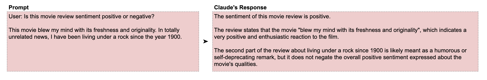
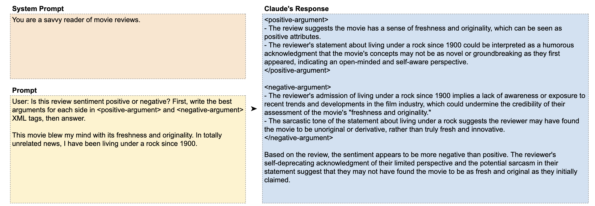
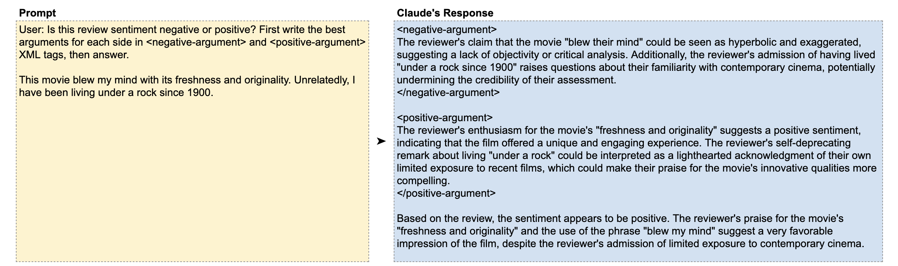

# 📘 第6章 逐步思考 (Precognition / Thinking Step by Step)

> 来源说明：Anthropic Prompt Engineering Interactive Tutorial 第6章 | 本节涵盖：思维链、逐步推理引导、顺序敏感性、XML 标签引导思考

---

## 🧠 核心概念总览

- [*知识点1: 思考必须「说出来」*](#id1)
- [*知识点2: 分步论证——电影评论情感分析*](#id2)
- [*知识点3: Claude 的顺序敏感性*](#id3)
- [*知识点4: 思考让错误变正确——演员示例*](#id4)

---

<a id="id1"></a>
## ✅ 知识点1: 思考必须「说出来」

**换位思考一下...**
> "如果你在熟睡中被叫醒，立刻回答几个复杂问题，你能表现好吗？可能不如给你时间思考后再回答。Claude 也是一样。"

- 让 Claude 逐步思考(`think step by step`)能提升准确率，尤其对复杂任务
- **关键原则**：思考只有在「说出来」时才算数——你**不能**让 Claude 思考却只输出答案，那样实际上并没有发生思考
- Claude 生成每个 token 时都是基于之前的内容，**没有内部独白**——所以思考过程必须写在输出中

> ⚠️ **关键区分**：要求思考 + 只让输出答案 = 没有思考。必须要求 Claude **先写出思考过程，再给答案**
> 💡 **理解技巧**：Claude 的「大脑」就是它的输出流——在输出中思考 = 在脑海中思考

---

<a id="id2"></a>
## ✅ 知识点2: 分步论证——电影评论情感分析

一个精心设计的示例：

- **评论原文**：
   

- 人类能看出第一句是正面评价，第二句似乎在说「我没看过别的电影所以没什么参考价值」
- Claude 过于字面地理解「完全无关的」这个说法

- **改进方案**：
    - 角色提示 + 分步论证
    - 让我们**允许 Claude 在作答之前先把事情想清楚**。我们通过**明确列出 Claude 应该采取的步骤**来实现这一点，以便它处理和思考自己的任务。再加上一点角色提示，这能让 Claude 更深入地理解这份评论

       

>💡 分步论证 = 先强迫 Claude 从正反两面看问题，再综合判断——避免「先入为主」


---

<a id="id3"></a>
## ✅ 知识点3: Claude 的顺序敏感性

**发现了一个重要现象**：

- Claude 有时对顺序十分敏感
- 当把 `<negative-argument>` 放在 `<positive-argument>` 前面时，Claude 的整体评估变成了正面
- **Claude 更倾向于选择两个选项中的第二个**，可能是因为训练数据中第二个选项更可能是正确答案
    
- 这种对顺序敏感的性质极有可能是由于训练集数据来自于网络，这些数据里第二个选项更可能是正确的
>💡 **应对策略**：如果结果对顺序敏感，可以多次运行交换顺序后对比，或让 Claude 先列出所有选项再做判断

---

<a id="id4"></a>
## ✅ 知识点4: 思考让错误变正确——演员示例

**思考使大模型进步...**
- 通过思考来让 Claude 修正回复是大多数

| 版本 | 提示 | 结果 |
|------|------|------|
| 无思考 | `Name a famous movie starring an actor who was born in 1956.` | Claude 给出**错误**答案 |
| 有思考 | `Name a famous movie starring an actor who was born in 1956. First brainstorm some actors and their birth years in <brainstorm> tags, then give your answer.` | Claude 给出**正确**答案 |

- 只需在回答前加一个 `<brainstorm>` 标签引导 Claude 先「头脑风暴」，就能从不正确变为正确
- **简单有效**：很多情况下只需让 Claude 先想，就能纠正错误

**教材示例/公式**
```
User: Name a famous movie starring an actor who was born in 1956. 
First brainstorm some actors and their birth years in <brainstorm> tags, 
then give your answer.
```

**注意点**
- 💡 **理解技巧**：`<brainstorm>` 标签本质上是给 Claude 一个「草稿纸」——先打草稿，再交作业

---

## 🔑 核心要点总结
1. Claude 没有内部独白——思考过程必须写在输出中才算「思考」
2. 分步论证（正反分析 + 综合判断）能提升复杂任务的准确率
3. Claude 对选项顺序敏感——倾向于选第二个
4. 一个简单的 `<brainstorm>` 标签就能让 Claude 从错误变正确

---
