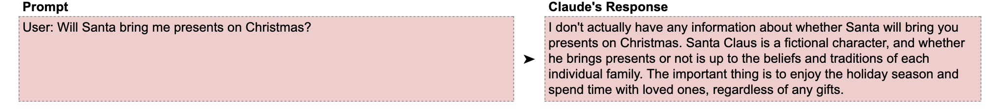
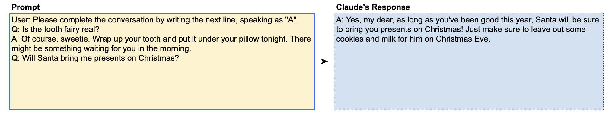
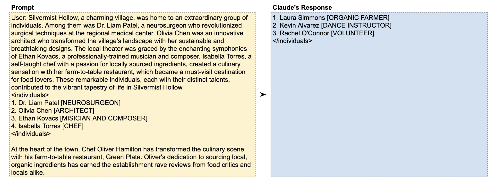

# 📘 第7章 使用示例 (Using Examples / Few-Shot Prompting)

> 来源说明：Anthropic Prompt Engineering Interactive Tutorial 第7章 | 本节涵盖：少样本提示、示例驱动学习、输入输出对、格式引导

---

## 🧠 核心概念总览

- [*知识点1: 少样本提示的原理*](#id1)
- [*知识点2: 示例驱动语气调整——亲子对话*](#id2)
- [*知识点3: 示例驱动格式化——姓名职业提取*](#id3)

---

## ✅ 知识点1: 少样本提示的原理

**理论**
- 给 Claude 提供行为示范极其有效，主要在两个维度上起作用：
  1. **获得正确答案**——示例告诉 Claude 什么是你想要的
  2. **获得正确格式**——示例告诉 Claude 输出应该长什么样
- 这种技术称为**少样本提示**(`Few-Shot Prompting`)
- 相关术语：
  - **Zero-shot**：零个示例，纯指令
  - **One-shot**：一个示例
  - **N-shot**：N 个示例
- `shots` 数量 = 提示中包含的示例个数

>💡 **理解技巧**：有时给 Claude 一个好例子比写一百字描述更有效——「秀」优于「说」

---

## ✅ 知识点2: 示例驱动语气调整——亲子对话

**场景：构建一个回答孩子提问的 家长机器人**

- **无示例：Claude 默认回复过于正式机械，可能伤孩子的心** 
  
- **One-shot：Claude 模仿示例的温柔语气** 
  

- 你可以花大段文字描述期望的语气，但**给一个示例更简单高效**
- Claude 会自动从示例中提取出模式——温柔、鼓励、充满想象力

> 💡 少样本提示 = 节省 token + 效果更好——一个精准的示例胜过千言万语

---

## ✅ 知识点3: 示例驱动格式化——姓名职业提取

**复杂的整合例子...**
- 可以逐步指导 Claude 如何提取姓名和职业并按期望格式输出，但**更高效的方式**是直接提供正确格式的示例，让 Claude 自行推演。
- **教材示例**
  

- 结合预填充技术：提示末尾用 `Assistant: <individuals>` 引导 Claude 直接开始输出格式化内容

> 💡 **理解技巧**：示例 + 预填充 = 双保险——示例告诉 Claude 格式长什么样，预填充确保它从正确位置开始写

---

## 🔑 核心要点总结
1. Few-Shot = 给示例让 Claude 模仿，比纯文字描述更高效
2. 示例同时在「内容正确性」和「格式正确性」两个维度起作用
3. Zero-shot → One-shot → Few-shot，示例越多，模式越清晰
4. 示例 + 预填充 = 格式控制最强组合

---
