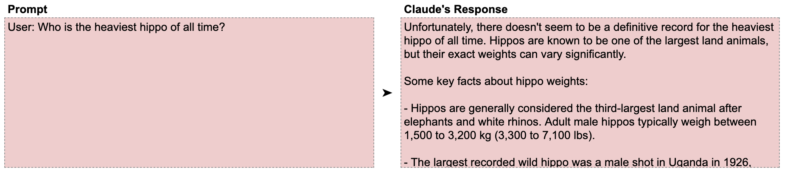
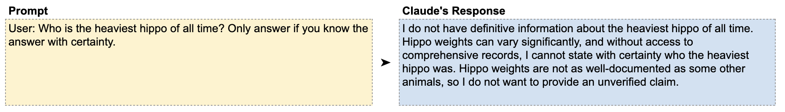
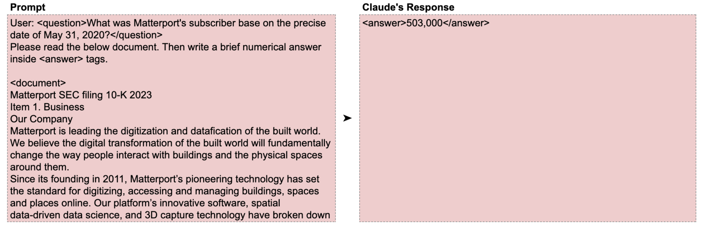
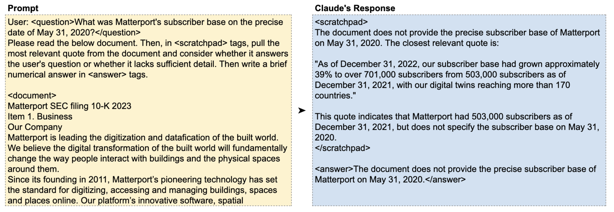

# 📘 第8章 避免幻觉 (Avoiding Hallucinations)

> 来源说明：Anthropic Prompt Engineering Interactive Tutorial 第8章 | 本节涵盖：幻觉成因与对策、给退路、证据先行、Temperature 参数

---

## 🧠 核心概念总览

- [*知识点1: 幻觉问题概述*](#id1)
- [*知识点2: 技术一：给 Claude 留退路*](#id2)
- [*知识点3: 技术二：先收集证据再回答*](#id3)
- [*知识点4: Temperature 参数与幻觉的关系*](#id4)

---

<a id="id1"></a>
## ✅ 知识点1: 幻觉问题概述

**Claude 自己也有问题...**
- "坏消息：Claude 有时会「幻觉」，做出不真实或无根据的断言。好消息：有很多技术可以最小化幻觉。"
- **幻觉**(`Hallucination`) = Claude 生成的内容看似合理但实际不正确
- 产生幻觉的一个关键原因：Claude **过度乐于助人**——它想给出答案，即使没有足够信息
- 之前学过的许多技术（角色提示、逐步思考等）也能帮助减少幻觉

> 💡 幻觉不能 100% 消除，但可以通过技术组合显著降低


---

<a id="id2"></a>
## ✅ 知识点2: 技术一：给 Claude 留退路

**那么如何解决这个幻觉呢? -- 接下来介绍两种方法**
- **方法**：告诉 Claude 它可以选择拒绝回答，或只在确定知道答案时才回答
- 这解决了 Claude「过度乐于助人」的问题——它不再被迫编造答案

- **教材示例：河马问题**
  -  **无保护： Claude 幻觉出几头大河马** 
    

  - **有退路：Claude 正确拒绝或给出更谨慎的回答** 
    


>💡 **理解技巧**：给退路 = 告诉 Claude 「不知道」也是一个可以接受的答案
>⚠️ 在需要 Creative 回答的场景（如创意写作）不适用——此时「幻觉」可能是「创意」

---

<a id="id3"></a>
## ✅ 知识点3: 技术二：先收集证据再回答

**还有一种方法...**
- **方法**：要求 Claude 先从给定文档中提取相关引文（证据），然后基于引文回答
- 特别适用于**长文档问答**场景——文档中的干扰信息容易误导 Claude

**教材示例——Matterport SEC 文件**
- 问题：Matterport 在 2020年5月31日 的订阅用户数是多少？
- 文档：一份 SEC 10-K 文件，包含大量财务数据，但**完全没有 2020年5月31日的数据**（最近的是 2021年12月31日）
- **无证据先行**：Claude 被干扰信息误导，给出错误数字
  

- **有证据先行**：
  ```
  先在 <scratchpad> 中提取最相关的引文，判断引文是否回答了用户问题，
  然后在 <answer> 中给出简要数字答案。
  ```
  
- Claude 正确识别出引文并未回答问题


> 💡 **理解技巧**：让 Claude 先当「侦探」（找证据）再当「法官」（做判断）——角色分离防止跳跃推理
> 🔄 **知识关联**：与 Ch6（逐步思考）本质相同——在给出答案前插入一个验证步骤

---

<a id="id4"></a>
## ✅ 知识点4: Temperature 参数与幻觉的关系

**理论**
- **Temperature**(`温度`)是衡量答案创造性的参数，范围 **0 到 1**：
  - `0`：最一致、最确定，每次运行几乎得到相同答案（但不保证 100% 确定性）
  - `1`：最不可预测、最多样化
  - 中间值：创造性递增
- 降低温度可以减少幻觉——temperature=0 时 Claude 更倾向于给出保守、准确的答案
- 本教程全部使用 temperature=0，以获得更快更确定的结果

**注意点**
- ⚠️ **关键区分**：低温度 ≠ 零幻觉，只是降低了概率。真正的事实性保障还需结合其他技术
- 💡 **理解技巧**：temperature 就像 Claude 的「冒险指数」——0 = 循规蹈矩，1 = 天马行空
- 📋 **术语提醒**：`Temperature(温度参数)` = 控制输出随机性的参数

---

## 🔑 核心要点总结
1. 幻觉源于 Claude「过度乐于助人」——它不想说不知道
2. 技术一：给退路——"只在确定时回答"
3. 技术二：证据先行——先找引文再下结论
4. 降低 temperature 可以减少幻觉但不保证消除
5. 综合运用 Ch1-Ch7 的所有技术是最佳防幻觉策略

---
