# 📘 第9章 从零构建复杂提示 (Complex Prompts from Scratch)

> 来源说明：Anthropic Prompt Engineering Interactive Tutorial 第9章 | 本节涵盖：法律服务/金融服务实战、10 要素复杂提示模板、提示工程试错方法论

---

## 🧠 核心概念总览

- [*知识点1: 复杂提示的 10 大要素框架*](#id1)
- [*知识点2: 法律服务实战：宠物飓风法案例*](#id2)
- [*知识点3: 提示工程的方法论*](#id4)

---

<a id="id1"></a>
## ✅ 知识点1: 复杂提示的 10 大要素框架

**理论**
- 以下结构综合了多种提示工程元素，是构建复杂提示的一个良好起点。对于某些元素来说，顺序很重要，而对于另一些则不然。我们会在最佳实践表明顺序重要时加以说明，但总的来说，如果你遵循这个顺序，它将成为打造出色提示的良好开端。

- 在接下来的示例中，我们将构建一个用于**受控角色扮演**的提示，其中 Claude 将扮演一个具有特定任务的**情境角色**。我们的目标是让 Claude 扮演一位**友好的职业教练**。

- 教程为复杂提示总结了 10 个可组合的要素：


    1. **"`User:`" 开头** (必选)： 
        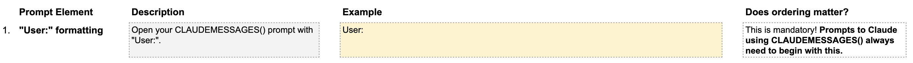

    2. **任务上下文** (必选) 赋予 Claude 角色和总体目标：
        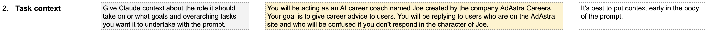
    3. **语气上下文**  (可选) 告知 Claude 应使用的语气：
        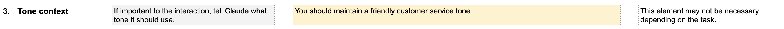
    4. **详细任务描述与规则** (必选) 展开任务要求，提供"退路"（不知道答案时怎么做）：
        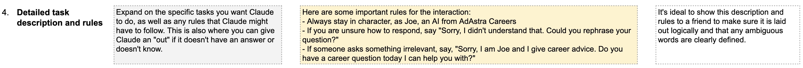
    5. **示例（Examples）** (强烈推荐) 至少一个理想回应的示例，用 `<example>` 标签包裹。**"示例可能是知识工作中让 Claude 按预期行为的最有效工具"**：
        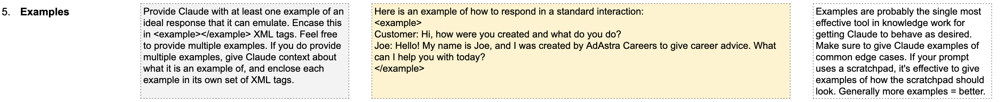
    6. **输入数据（XML标签包裹）** (可选) 需要处理的数据放入 `<tag>{{VARIABLE}}</tag>`：
        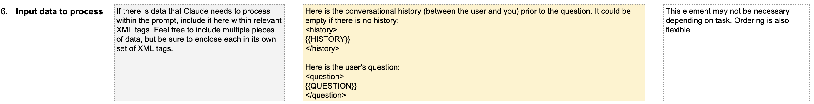
    7. **即时任务描述** (推荐) 在长提示末尾"提醒"Claude 当前要做什么：
         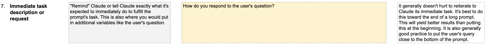
    8. **逐步思考** (可选)：
        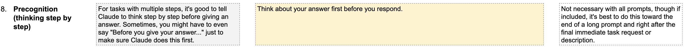
    9. **输出格式** (可选) 如 `Put your response in <answer> tags.` ：
        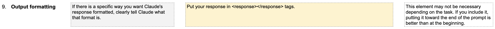
    10. **预填充回复**(可选) 在 `Assistant:` 后预填引导内容 ：
        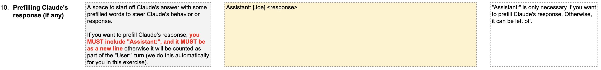

> ⚠️ 要素之间顺序可以调整，教程强调<b>"提示工程在于科学的试错"</b>

---

<a id="id2"></a>
## ✅ 知识点2: 法律服务实战：宠物飓风法案例

**下面来看一个完整例子...**
- 下面，我们详细列出了一个**法律用例**的示例提示，其中我们让 Claude 回答关于某个法律问题的提问。（我们建议你**先到最底部**，了解我们要让 Claude 处理哪些输入，然后再研究我们写的提示）。我们调整了其中一些元素的顺序，以展示**提示结构是可以灵活变通的**！

- 提示工程讲究的是**科学的反复试验**。我们鼓励你混搭、调换位置（那些顺序不重要的元素），然后找出**最适合你和你的需求**的方式。

    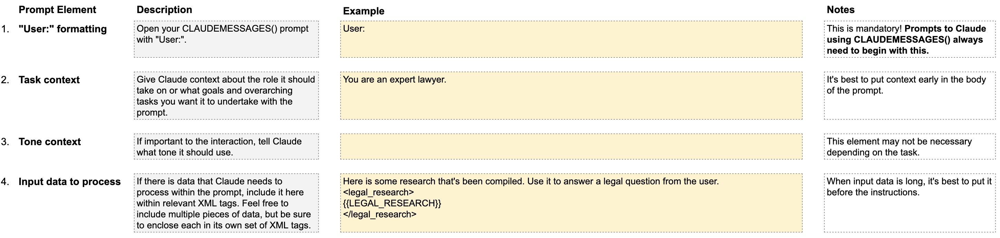
    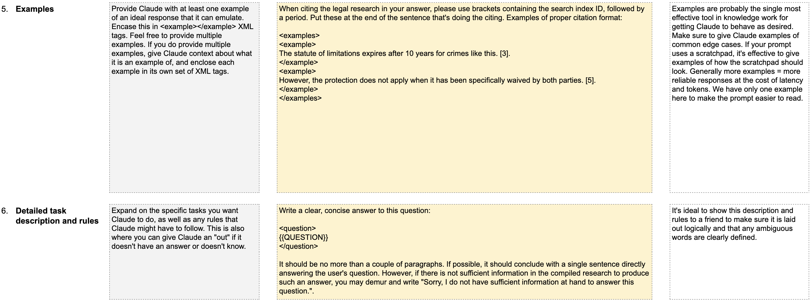
    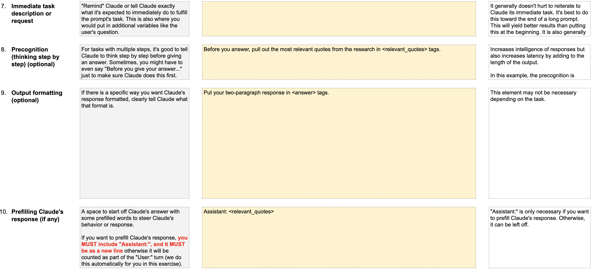

- **输入变量**：
    - `{{QUESTION}}` = "Are there any laws about what to do with pets during a hurricane?"
    - `{{LEGAL_RESEARCH}}` = 3 条搜索结果（动物健康专利诉讼、兽医牙科执业、Katrina 飓风后宠物疏散立法）

> 💡 这个模板展示了**工厂流水线**式的提示设计——固定框架 + 可变输入 + 引用格式规范
> ⚠️ 长文档时最佳实践是将问题放在文档**底部**，但教程为可读性将问题放在了顶部

- Claude 回复：
    ```txt
    """In 2006, Hawaii, Louisiana, and New Hampshire all enacted laws that address issues regarding the 
    care of animals during disasters, such as providing shelters for pets and allowing service animals 
    to be kept with the people they serve. In addition, Congress passed, and the President signed, 
    the Pet Evacuation and Transportation Standards Act during 2006, which requires state and local 
    emergency preparedness authorities to include in their evacuation plans information on how they 
    will accommodate household pets and service animals in case of a disaster."" [3]
    ""California passed a law that will require its Office of Emergency Services, Department of Agriculture, 
    and other agencies involved with disaster response preparation to develop a plan for the needs of 
    service animals, livestock, equids, and household pets in the event of a disaster or major emergency."" [3]
    </relevant_quotes>

    <answer>
    The research indicates that there are several laws in place regarding the treatment of pets
     during natural disasters like hurricanes. In 2006, several states, including Hawaii, Louisiana, 
     and New Hampshire, enacted laws that require shelters to accommodate pets and allow service animals 
     to remain with their owners during evacuations. [3] Additionally, the federal government passed 
     the Pet Evacuation and Transportation Standards Act in 2006, which mandates that state and local 
     emergency preparedness authorities include plans for accommodating household pets and service animals 
     in their disaster response plans. [3] California has also passed a law requiring state agencies to 
     develop plans for addressing the needs of pets, livestock, and other animals during emergencies. [3]

    In summary, there are now various laws in place that require emergency authorities to make provisions 
    for the care and evacuation of pets during natural disasters like hurricanes.
    </answer>"


    ```

---

<a id="id4"></a>
## ✅ 知识点3: 提示工程的方法论

**教程在结尾提供了 8 条后续学习路径**：

1. 📚 从 [Anthropic Cookbook](https://docs.anthropic.com) 学习生产级提示词示例
2. 📖 阅读 [Anthropic 提示指南](https://docs.anthropic.com/claude/docs/prompt-engineering)
3. 💡 查看 [Prompt Library](https://anthropic.com/prompts) 获取灵感
4. 🤖 尝试 [Metaprompt](https://docs.anthropic.com/claude/docs/helper-metaprompt-experimental) ——让 Claude 为你写提示模板
5. 💬 在 [Discord](https://anthropic.com/discord) 服务器中提问
6. ⚙️ 了解 [API](https://anthropic.com/discord) 参数：temperature、max_tokens 等
7. 📄 阅读提示工程[学术论文](https://www.promptingguide.ai/papers)
8. 🛠️ 练习构建提示词，让 Claude 做你感兴趣的事

- 教程结语：
    > "如果你完成了所有练习，你已跻身顶尖 0.1% 的 LLM 驾驭者。提示工程是一门新兴学科，保持开放心态——**你完全有可能发现下一个伟大的提示技巧。**"

> 💡 **核心方法论**：提示工程不是死记硬背——从逐步思考到角色分配到使用示例再到清晰写作，这些技巧可以**被融合、重组并以无数方式改编**


---

## 🔑 核心要点总结
1. 复杂提示 = 10 要素的灵活组合，不是死板模板
2. 示例（要素5）是最有效的知识工作提示工具
3. 法律 vs 金融：不同行业对提示结构的侧重点不同
4. 提示工程是**试错科学**——测试用例 + 结构实验 = 好提示

---