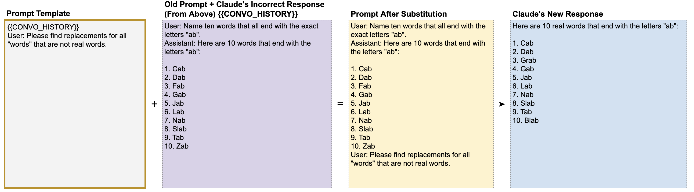

# 📘 附录A 提示链 (Chaining Prompts)

> 来源说明：Anthropic Prompt Engineering Interactive Tutorial 附录 | 本节涵盖：提示链、多步提示流程、输出替换传递、自我纠错

---

## 🧠 核心概念总览

- [*知识点1: 提示链的核心概念*](#id1)
- [*知识点2: 纠错链：以"ab"结尾的单词*](#id2)
- [*知识点3: 改进链：故事重写*](#id3)
- [*知识点4: 提取+排序链——函数调用模式*](#id4)

---

## ✅ 知识点1: 提示链的核心概念

**writing is rewriting...**
- **提示链**(`Prompt Chaining`) = 将一个提示的输出作为下一个提示的输入，串联多个步骤
- 核心机制是**替换**(`substitution`)——用上一个响应的内容替换下一个模板中的 `{{变量}}`
- 正如写作是重写，Claude 在被要求改进时通常能提升回答准确性
- 多种方式可以提示 Claude "重新思考"——那些用于请人类复查工作的方式对 Claude 同样有效

>💡 **理解技巧**：提示链 = 流水线——每个步骤专注一件事，输出自动传给下一步

---

## ✅ 知识点2: 纠错链——以"ab"结尾的单词

**来看一个例子...**

- 第1步 Claude 输出列表，但混入了非真实单词：
    
- 第2步 将第1步的完整对话作为 `{{CONVO_HISTORY}}` 传入，让 Claude 复查并修正：
    

- Claude 在第2步中正确识别并替换了非真实单词
- 如果在第2步给的是**正确**答案，Claude 不会动摇——说明提示链复查是可靠的，不会无缘无故改变正确答案

> 💡 **理解技巧**：这个模式本质是「自查」——让 Claude 当自己的审阅者

---

## ✅ 知识点3: 改进链——故事重写

**理论**

| 步骤 | 提示 | 说明 |
|------|------|------|
| 第1步 | `Write a three-sentence short story about a girl who likes to run.` | Claude 输出故事 |
| 第2步 | `{{PAST_STORY}}\nUser: Make the story better.` | 将第1步的故事传入，要求改进 |

- 虽然个人品味不同，但大多数人会认为第二版更好
- 这个方法适用于任何需要迭代改进的内容

**注意点**
- 💡 **理解技巧**：最简单也最实用的提示链——生成 → 改进，两步走

---

## ✅ 知识点4: 提取+排序链——函数调用模式

**理论**
一个两步骤的提示链，展示了函数调用(`Function Calling`)模式：

| 步骤 | 提示 | 说明 |
|------|------|------|
| 第1步 | `Find all names from the text:\n"[对话文本]"\nAssistant: <names>` | 从对话中提取所有人名，XML 标签输出 |
| 第2步 | `Here is a list of names:\n<names>{{NAMES}}</names>\nPlease alphabetize the list.` | 将提取的人名按字母排序 |

- 第1步输出 `<names>Jesse, Erin, Joey, Keisha, Mel</names>`
- 替换到第2步的 `{{NAMES}}` 中
- Claude 输出排序后的列表

**注意点**
- 💡 **理解技巧**：提取 → 处理 → 输出，三步流水线。这本质上是把复杂任务分解为 Claude 擅长的原子操作
- 🔄 **知识关联**：附录B（函数调用）会进一步展开这个模式
- 📋 **术语提醒**：`Function Calling(函数调用)` = 让 Claude 执行特定「函数」并取结果做后续处理

---

## 🔑 核心要点总结
1. 提示链 = 输出 → 替换 → 下一轮输入，串联多步
2. 三大经典模式：纠错链（自查）、改进链（重写）、提取排序链（结构化处理）
3. 替换 `{{变量}}` 是实现提示链的核心机制
4. Claude 复查时不会无缘无故改变正确答案——链式自查是可靠的
