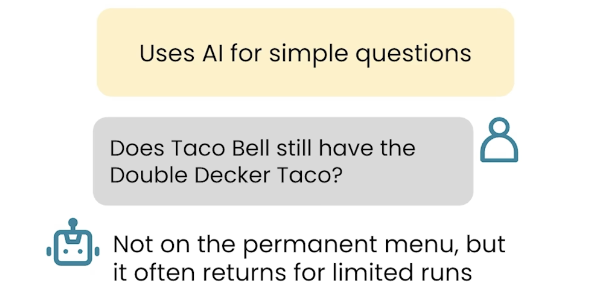
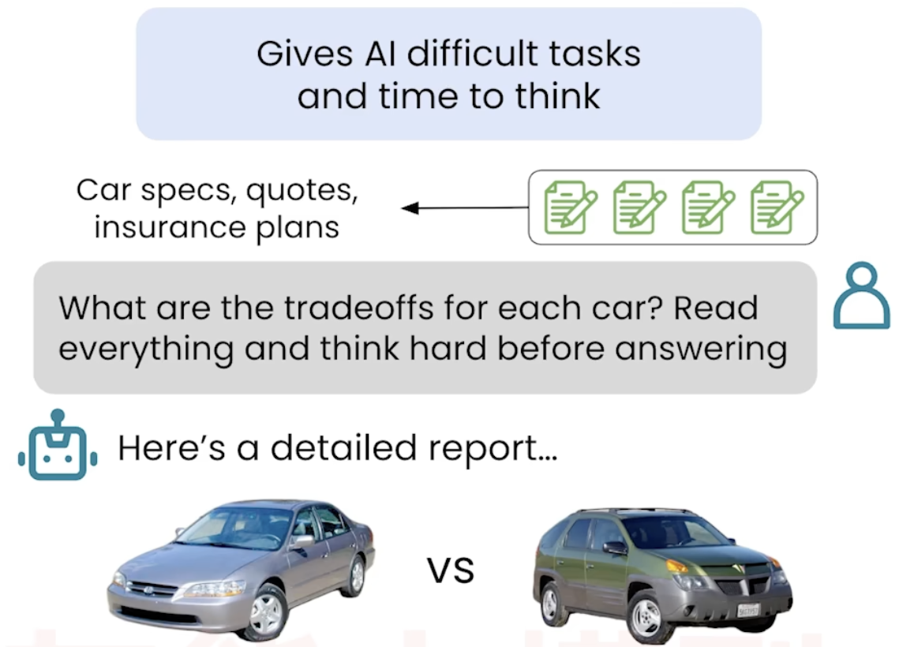
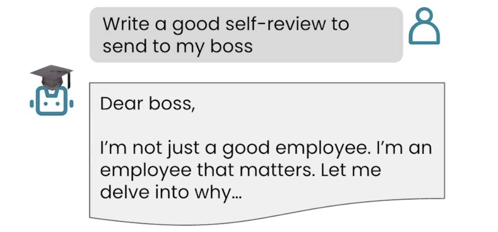
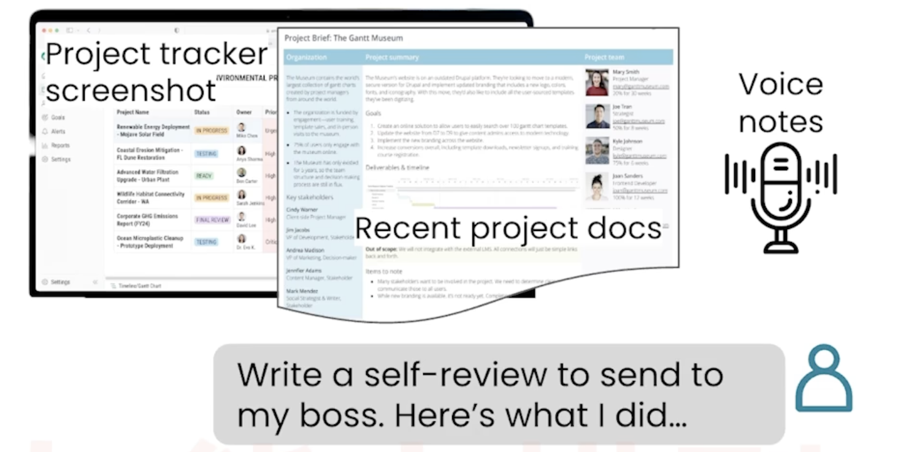
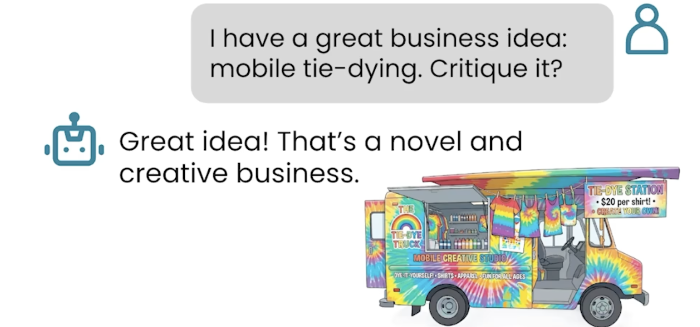
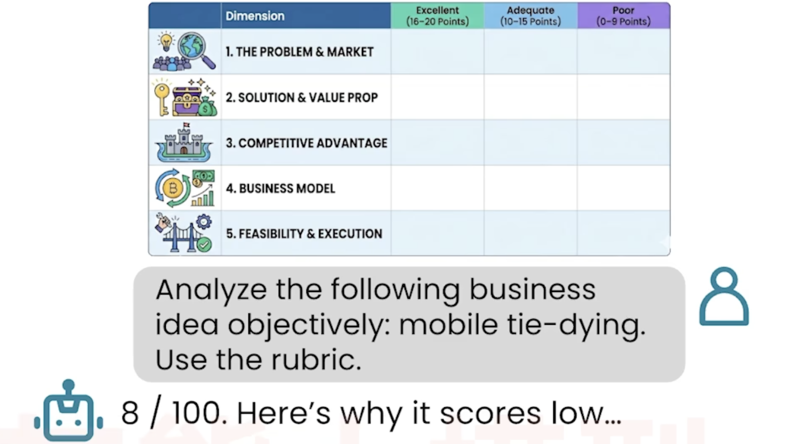
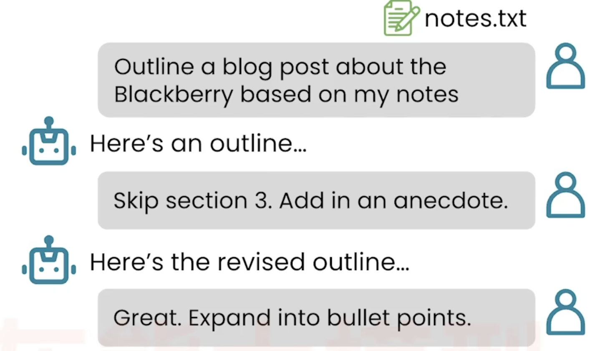

# 📘 01 AI 新手与 AI 高手 (The AI Novice and the AI Power User)

> 来源：Andrew Ng | Module 1: Finding Information | 课时 1/5 | ~8 分钟

---

## 🧠 核心概念总览

- [*知识点1: 简单提问 vs 复杂提问*](#id1)
- [*知识点2: 提供上下文 vs 不提供上下文*](#id2)
- [*知识点3: 不避免 AI 谄媚 vs 避免 AI 谄媚*](#id3)
- [*知识点4: 一步到位 vs 迭代打磨*](#id4)
- [*知识点5: AI 的「愚蠢错误」不应让你低估它*](#id5)

---

<a id="id1"></a>
## ✅ 知识点1: 简单提问 vs 复杂提问

**新手老手的区别：提问方式...**
- **新手做法**：一问一答，浅层信息获取
    

- **高手做法**：
    - 给 AI **多个文档**作为上下文
    - 明确要求「思考后再回答」（`think hard before answering`）
    - 允许 AI 花**数秒甚至数分钟**去处理
    


- **为什么这样有效**
    - AI 需要信息才能给出好答案——这和人类一样
    - 说「慢慢想」会触发 AI 做更深层的推理

---

<a id="id2"></a>
## ✅ 知识点2: 提供上下文 vs 不提供上下文
**新手老手的区别：是否提供上下文...**
- **新手做法**：AI 只能输出**泛泛的套话**，因为没有关于你工作的任何信息
    ```
    请帮我写一份好的自我评估。
    ```
    

- **高手做法**：AI 有具体的工作成果和数据，能写出**针对性强**的内容。
    ```
    （上传：项目追踪器截图 + 项目文档 + 语音备忘录录音）
     基于这些材料，帮我写一份自我评估。
    ```
    


> ⚠️ 注意：把 AI 当作一个非常聪明但刚毕业的大学生——你需要给它足够的背景信息，它才能做好工作。
---

<a id="id3"></a>
## ✅ 知识点3: 不避免 AI 谄媚 vs 避免 AI 谄媚

**新手老手的区别：是否避免 AI 谄媚...**

- **新手做法（诱导式提问）**：**询问有偏见的问题**，AI 会**顺着你说**："这个主意太棒了！很有创意！"——这就是 `谄媚效应(Sycophancy)`
    ```
    我有一个很棒的商业创意：移动扎染服务。请点评一下。
    ```
    


- **高手做法（中立客观提问）**：**隐藏你自己的立场**，AI 会给出**诚实的低分**（比如 "8 分/100 分"），并列出具体的质疑。
    ```
    请客观分析以下商业创意：移动扎染服务。
    评估标准：
    - 是否存在真实的问题需要解决？
    - 是否存在足够大的市场？
    - 有没有竞争壁垒？
    ```
    


> ⚠️ 注意：AI 倾向于讨好你。如果你已经表明自己喜欢某个想法，AI 就会顺着说
> 💡 **核心技巧**：想让 AI 说真话，**隐藏你自己的立场**。用「分析」代替「夸我」，给评分标准而不是给结论


---

<a id="id4"></a>
## ✅ 知识点4: 一步到位 vs 迭代打磨
**新手老手的区别：**

- **新手做法**：**"AI slop"（AI 垃圾输出）**——泛泛而谈，毫无特色
    ```
    写一篇关于黑莓手机的博客文章。
    ```
    


- **高手做法（4 步迭代法）**—— 精细打磨

    | 步骤 | 操作 | 目的 |
    |------|------|------|
    | 1 | 先让 AI **列大纲**（基于你提供的笔记/素材） | 确保覆盖你要的点 |
    | 2 | **点评大纲**，指出删改之处 | 你自己掌控结构 |
    | 3 | 让 AI 将大纲**展开为要点** | 逐步增加细节 |
    | 4 | 多次往返修改后，最终**生成全文** | 保证质量和个性化 |

    

- **为什么这样有效**
    - 每步只让 AI 做一件事，你始终在方向盘后面
    - 在早期（大纲阶段）修正方向，比在成文后推翻重写高效得多

---

<a id="id5"></a>
## ✅ 知识点5: AI 的「愚蠢错误」不应让你低估它

**不要去低估了AI的能力...**
- 网上流传的 AI 翻车案例：
    - 「strawberry 里有几个 R？」→ AI 答 2 个（实际 3 个）
    - 「我想洗车，应该走路去还是开车去？」→ AI 说走路去

- 这些病毒式传播的错误案例 **不代表 AI 的真实能力**。2022-2023 年的 AI 犯的错误远比现在多
> 📋 关键心态：AI 是工具，了解它的真实边界（而非 meme 里的边界）才能用好它

---

## 🔑 本课核心要点

1. **AI 高手的关键思维**：把 AI 当聪明但需要上下文的同事，而非全知全能的神谕
2. **给上下文 = 给质量**：上传文档、截图、录音——信息越多，输出越好
3. **中立提问避免谄媚**：隐藏你的立场，给评估标准而不是给结论
4. **写作要迭代**：大纲 → 点评 → 要点 → 成文，每步你在掌控方向

---
