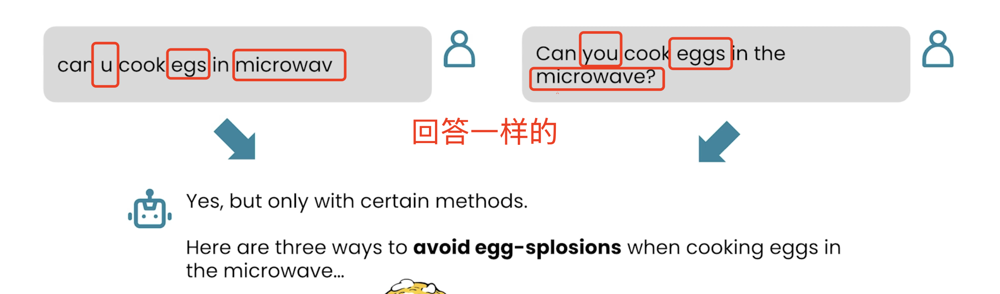

# 📘 02 预训练知识 (Pretrained Knowledge)

> 来源：Andrew Ng | Module 1: Finding Information | 课时 2/5 | ~6 分钟

---

## 🧠 核心概念总览

- [*知识点1: AI 如何「学习」——和人类一样靠阅读*](#id1)
- [*知识点2: 训练数据的频率效应——热门话题 vs 冷门话题*](#id2)
- [*知识点3: AI 的知识盲区*](#id3)
- [*知识点4: AI 对拼写错误的容忍度*](#id4)

---

## ✅ 知识点1: AI 如何「学习」——和人类一样靠阅读

**小时候你怎么学写作的？大概就是大量阅读。AI 也一样**

- AI 的知识来自哪里？它在**数万亿词**的互联网文本上训练而成。理解训练数据的来源、分布和局限性，你才知道什么该问 AI、什么不该问
  >💡 AI 不是「编程」出知识的——它是从海量文本中**统计学习**出来的
- AI 模型在 **数万亿到数十万亿词（trillions or tens of trillions of words）** 的文本上预训练
  >📋 `Pretrained Knowledge(预训练知识)` = 模型在训练阶段从文本中学到的所有知识，在推理时不会实时更新
- 预训练数据来源：社交媒体（Reddit、Quora）、书籍、维基百科、新闻、研究论文

---

## ✅ 知识点2: 训练数据的频率效应——热门话题 vs 冷门话题

**不同知识出现频率不同...**
- 训练数据中不同话题的出现频率差异巨大：
  - **高频**：烹饪、明星、电影 → AI 回答质量高
  - **低频**：类星体（quasar）等专业天文术语 → 训练数据中相关文章极少，回答质量下降
- 语言分布同样失衡：**粤语数据可能不到互联网内容的 0.1%**

>⚠️ **关键理解**：AI 对热门话题很擅长，对冷门/专业话题容易出错或给出表面回答
>💡 如果你的问题涉及小众领域，**多给上下文**（回到第 1 课的原则），而不是假设 AI 天然懂

---

## ✅ 知识点3: AI 的知识盲区

**AI 不知道的三类信息**

| 盲区 | 举例 | 为什么 |
|------|------|------|
| **私有数据** | 你公司的内部销售数据、未公开的专利 | 不在训练数据中 |
| **过时信息** | 训练截止日期之后发生的事 | 知识被「冻结」在训练结束时 |
| **错误信息** | 训练数据中的谣言、偏见、过时观念 | 模型会学习到错误内容 |

**例子**
  - 旅行者 1 号（Voyager 1）携带的金唱片：NASA 选了 55 种语言的问候语——AI 知道这个，因为它在训练数据中
  - 但 AI **不知道**你今天早上发了什么 Slack 消息——那是私有数据

---

## ✅ 知识点4: AI 对拼写错误的容忍度

**有趣的事实**
- AI 能理解拼写错误（typos），因为训练数据本身就包含大量错误拼写
  
- 如果你在 prompt 里打错字，AI 通常能正确理解你的意图
- 但 AI 也存在误解这些信息的可能

>💡 不需要像写代码那样追求完美拼写——但清晰度仍然重要（回到第 1 课的「给上下文」原则）

---

## 🔑 本课核心要点

1. AI 的知识来自互联网文本的统计学习，不是魔法也不是数据库查询
2. 热门话题回答好，冷门/专业话题容易翻车——这是训练数据分布决定的
3. AI 三大盲区：私有数据、训练截止后的新信息、训练数据中的错误
4. 预训练知识不够用 → 需要网络搜索（下一课）
---