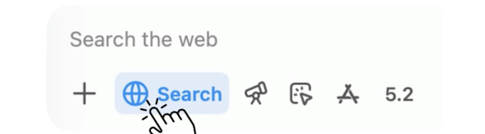

# 📘 03 网络搜索 (Web Search)

> 来源：Andrew Ng | Module 1: Finding Information | 课时 3/5 | ~5 分钟

---

## 🧠 核心概念总览

- [*知识点1: 知识截止日期——AI 的时间胶囊*](#id1)
- [*知识点2: 什么需要搜索 vs 什么不需要*](#id2)
- [*知识点3: 触发搜索的两种方式*](#id3)


---

<a id="id1"></a>
## ✅ 知识点1: 知识截止日期——AI 的时间胶囊

**AI 来源的知识也有时间...**

- AI 的知识被冻结在训练截止日期——网络搜索就是它的「解冻按钮」
  > 📋 `Knowledge Cutoff Date(知识截止日期)` = AI 最后一轮训练的时间点
- AI 模型训练在某个时间点停止，之后的知识「冻结在时间里」
- 如果你的问题涉及截止日期之后的事件，AI 要么不知道，要么会编造
  - **因此这时候需要网页搜索**，帮助其检索"新鲜的知识"

- **例子：2025 年的 67 meme**
  - 这个梗出现在 GPT-4 的知识截止日期（2025 年 8 月）**之后**，所以 AI 必须搜索才能回答
  - AI 看到「2025」这个年份会自动意识到需要更新的信息

> 💡 不同的 AI 模型有**不同的知识截止日期**，同一个问题的答案在新旧模型上可能完全不同


---

<a id="id2"></a>
## ✅ 知识点2: 什么需要搜索 vs 什么不需要

**什么时候需要网页搜索...**
- 判断标准：
  | 预训练知识就够 | 必须网络搜索 |
  |----------------|-------------|
  | 手机掉汤里怎么办 | **当前事件**：最近的新闻、赛事结果 |
  | 猫为什么盯着墙看 | **位置特定**：「附近评分最高的健身房」 |
  | 旅行者 1 号唱片内容 | **小众信息**：如「奶酪翻滚大赛」 |

- **奶酪翻滚大赛**
  - 人们追着一块滚下山的奶酪跑"这种小众地方活动
  - 预训练数据中不会出现，AI 可能意识到自身知识不足，需要检索
>💡 判断标准很简单：**这个问题是不是最近发生的？是不是跟你所在的特定位置/公司/场景有关？是不是小众事件**

---

<a id="id3"></a>
## ✅ 知识点3: 触发搜索的两种方式

**如何触发网页搜索...**
- **方式一：AI 自动判断**
  - 当你问「今天天气怎么样」或「最新新闻」时，AI 会**自行决定**执行搜索
  - 不需要你手动操作

- **方式二：用户明确触发**
  - 点击界面中的搜索按钮
    
  - 或在 prompt 中显式要求：
    ```
    请帮我搜索一下...
    please do a web search for this
    ```

> ⚠️ 并非所有 AI 模型都支持网络搜索——使用前先确认你的工具是否开启了搜索功能
> ⚠️ 搜索可能返回**不可靠的来源**（下一课会详细展开）

---

## 🔑 本课核心要点

1. AI 的知识有截止日期——截止日期之后的事情它不知道
2. 判断是否需要搜索：涉及最近事件？涉及你的特定位置/场景？→ 搜索
3. 触发搜索有两种方式：AI 自动判断 + 你手动触发

---