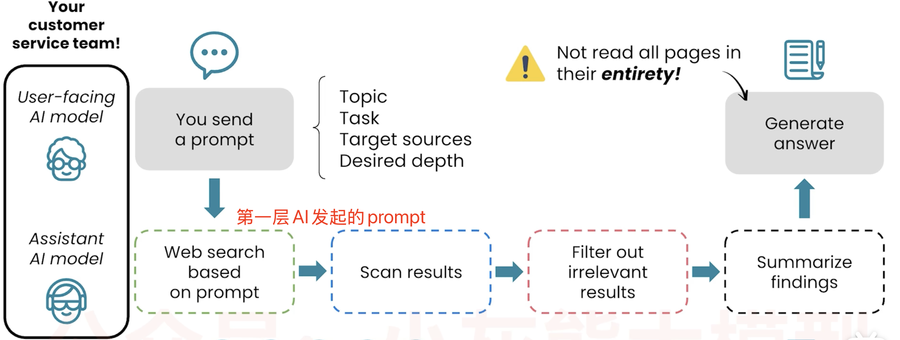

# 📘 04 网页搜索来源 (Web Search Sources)

> 来源：Andrew Ng | Module 1: Finding Information | 课时 4/5 | ~8 分钟

---

## 🧠 核心概念总览

- [*知识点1: 网页搜索的来源质量陷阱*](#id1)
- [*知识点2: AI 搜索的双层模型架构（核心机制）*](#id2)
- [*知识点3: 什么时候用 AI 搜索 vs 传统搜索引擎*](#id3)
- [*知识点4: Deep Research 预告*](#id4)

---

## ✅ 知识点1: 网页搜索的来源质量陷阱

**问题：网络搜索不等于答案可靠**
- 网页搜索（无论人类用 Google/Bing，还是 AI 搜索）天然倾向于引用**流行来源**
- AI 引用最多的网站排名：**1.Reddit 2.Wikipedia 3.YouTube 4.Google 5.Yelp…**
- 这些来源中，有些可靠（Wikipedia），有些则缺乏科学验证（Reddit、Quora）或存在商业利益（Yelp、电商网站）

- **两个具体案例**

     | 案例 | 问题 | 教训 |
     |------|------|------|
     | 「绿色市场肽类补充剂安全吗？」 | AI 搜到 Reddit、Quora、销售肽类产品的商业网站——回答可能不准确 | 要求 AI 使用**官方卫生机构**来源，就能引到 WHO、FDA、EMA |
     | 「Henderson, Nevada 哪里跑步好？」 | AI 引用了**二十多年前**的网页，推荐的学校场地已不对外开放 | AI 搜索的时效性不如专门的跑步 App/社区 |

>💡 **来源污染是 AI 搜索的头号问题**——AI 看到的不是真相，而是流行度排名
>🔄 解决方法很简单：**在 prompt 里指定来源类型**（`请使用官方卫生机构的数据`）

---

## ✅ 知识点2: AI 搜索的双层模型架构（核心机制）

**来看看 AI 搜索的真实工作机制（双层模型架构）你才能判断什么时候用 AI 搜索、什么时候用传统搜索引擎**

- **双层架构**
     

- **关键发现**
     > "第一层模型**并没有完整阅读所有引用的网页**，它只看到了第二层模型给出的摘要。"

- 这意味着：
     - AI 可能**误解**底层网页的实际内容（摘要不准确）
     - AI 可能**漏掉**网页中的关键细节（摘要省略了）
     - 你看到的引用脚注，AI 自己其实没有完整读过

- **马丘比丘徒步的例子**
     - 用户问：「去马丘比丘徒步前需要了解什么？」
     - 第二层模型会同时搜索多个关键词：Machu Picchu permits（许可证）、Machu Picchu weather（天气）等
     - 然后过滤、总结相关网页，将摘要返回给第一层
     - 第一层基于摘要生成最终回答

> ⚠️ **关键警告**：AI 的搜索回答是「摘要的摘要」——两层信息压缩带来的失真风险不可忽略
> 💡 对于重要决策（医疗、法律、财务），AI 搜索只能作为**起点**，必须人工核对原始来源

---

## ✅ 知识点3: 什么时候用 AI 搜索 vs 传统搜索引擎

**什么时候用传统引擎，什么时候用 AI ?**

- **对比**：

     | 场景 | 用传统搜索引擎 | 用 AI 搜索 |
     |------|--------------|-----------|
     | 想看多个来源快速浏览 | ✅ | ❌ |
     | 导航到特定网站 | ✅ | ❌ |
     | 查看原始数据（如购物比价） | ✅ | ❌ |
     | 从多个来源获得综合摘要 | ❌ | ✅ |
     | 需要权衡利弊的复杂问题 | ❌ | ✅ |
     | 对比多个来源得出综合结论 | ❌ | ✅ |

**Andrew Ng 的建议**
> "你在 Google 或其他搜索引擎上积累的好习惯，在用 AI 搜索时同样有用。"

**注意点**
- 💡 AI 搜索擅长**综合与对比**，传统搜索擅长**原始数据与导航**——两者互补，不是替代关系

---

## ✅ 知识点4: Deep Research 预告

本课结尾引出下一课的主题——深度研究（Deep Research）：

> "AI 模型具备一种更广泛的研究能力，叫做 Deep Research。这是一个非常强大的功能，我认为目前被很多人严重低估和忽视。"

**注意点**
- 🔄 Deep Research ≠ 普通网页搜索——它是 AI 做更深、更广的多轮研究（下一课详细展开）

---

## 🔑 本课核心要点

1. AI 搜索倾向流行来源（Reddit > 科学论文），**在 prompt 中指定来源类型**可以改善
2. AI 搜索采用**双层模型架构**：你看到的是「摘要的摘要」，存在信息失真的风险
3. AI 搜索适合综合对比，传统搜索引擎适合导航和原始数据——两者互补
4. 重要决策时，AI 搜索结果只能作为起点，必须核对原始来源

---