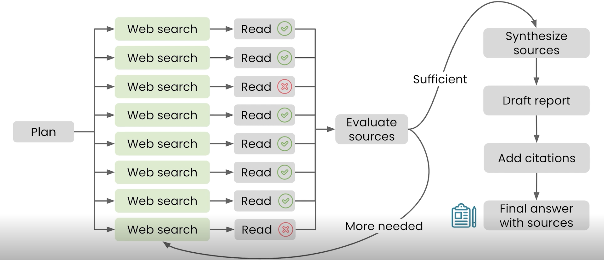

# 📘 05 使用深度研究 (Using Deep Research)

> 来源：Andrew Ng | Module 1: Finding Information | 课时 5/5 | ~8 分钟

---

## 🧠 核心概念总览

- [*知识点1: Deep Research 是什么——Agentic AI 的工作流*](#id1)
- [*知识点2: 三种信息获取模式的对比框架*](#id2)

---

## ✅ 知识点1: Deep Research 是什么——Agentic AI 的工作流

**Deep Research 是一种 Agentic AI**

- Agentic AI 不只是回答，而是自主规划研究路径、并行搜索数十个来源、迭代深化、最终生成带引用的报告。但它需要数分钟，所以你必须**主动选择**使用它
- **为什么叫 Agentic AI**
  - AI 在「决定下一步搜索什么」方面有自主权——它不是一个被动的问答机器，而是一个主动的研究者

- **Deep Research 的完整流程**

  | 步骤 | AI 做什么 | 你在做什么 |
  |------|----------|-----------|
  | 1. 理解问题 | 分析你给的所有上下文 | — |
  | 2. 生成研究计划 | 提出需要研究的方向和来源类型 | **审核/编辑研究计划** |
  | 3. 并行搜索 | 同时发起多个网络搜索，拉取多个网页 | 等待 |
  | 4. 迭代深化 | 阅读页面、综合学习、确定来源，决定是否继续回去执行更多搜索 | 等待 |
  | 5. 生成报告 | 自主判断任务完成后，整合所有网页，输出带引用的详细研究报告 | 阅读、验证 |
  
  

- **底层工作原理 -- 并行搜索：**
  - AI 制定研究计划后，**同时发起多个搜索**（而不是一个一个搜）
  - **同时拉取多个网页**（并行下载）
  - 评估哪些来源相关，决定是否追加搜索
  - 最终综合所有页面生成带引用的报告

  >💡 并行搜索是 Deep Research 比「你自己在 Google 上搜 30 次」快得多的技术原因

- **实例：万圣节鬼屋策划**
  - 输入：位置、前院面积、想要的体验类型
  - AI 的研究计划包括：搜索当地许可法规、消防指南、装饰创意
  - 最终输出：详细报告 + 预算饼图 + 噪音法规可视化 + 可操作的清单

>💡 Deep Research ≠ 多问几个问题——它是一次**自主的多轮研究行动**
>⚠️ 你需要审核 AI 提出的研究计划——方向不对，后面的努力全是白费

---

## ✅ 知识点2: 三种信息获取模式的对比框架

**AI web search 和 deep research都使用互联网和网页，那么两者有何区别？**

- **pretraining VS web search VS deep research**：
  | | 预训练知识 | 网络搜索 | Deep Research |
  |------|----------|---------|--------------|
  | **知识来源** | 模型内置 | 少量网页 | 数十个以上来源 |
  | **时效性** | 可能过时 | 最新 | 最新 |
  | **耗时** | 数秒 | 数十秒 | 数分钟或更久 |
  | **触发方式** | 自动（默认） | 自动或手动 | **必须手动触发** |
  | **典型场景** | 事实、定义、常识 | 单一问题 | 需要综合多方观点的复杂问题 |

- **何时用哪个？判断标准**

  | 场景 | 用什么 |
  |------|--------|
  | 「手机掉汤里了怎么办？」 | 预训练知识 |
  | 「附近评分最高的健身房？」 | 网络搜索 |
  | 「迪拜天气？」 | 网络搜索 |
  | 「每日步数对长期健康的影响？」 | **Deep Research** |
  | 「天气如何影响迪拜旅游业？」 | **Deep Research** |

- **总结**：
  - Web search 适合我用几秒钟、查几个来源就能完成的工作
  - Deep Research 适合需要阅读最新科学文章并深入思考的问题——不能让 AI 只取互联网上的流行答案

> 💡 判断口诀：**单一事实 = 搜索，多维分析 = 深度研究**
> ⚠️ AI 不会主动帮你用 Deep Research（因为不想让你等几分钟），你必须自己判断并发起

---

## 🔑 本课核心要点

1. Deep Research 是 Agentic AI——它自己规划搜索路径，不是被动回答
2. 三种模式（预训练 → 搜索 → 深度研究）覆盖从秒级到分钟级的全部信息获取场景
3. 判断标准：单一简单问题用搜索，复杂多维问题用深度研究
4. Deep Research 需要你**主动选择**——AI 不会替你决定

--- 