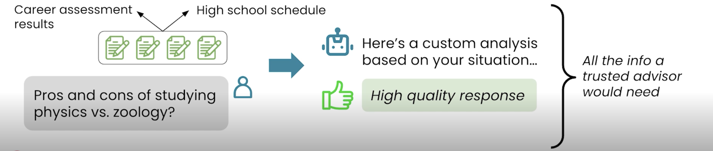

# 📘 07 上下文 (Context)

> 来源：Andrew Ng | Module 2: AI as a Thought Partner | 课时 2/7 | ~6 分钟

---

## 🧠 核心概念总览

- [*知识点1: 人类 vs AI 的上下文窗口*](#id1)
- [*知识点2: 长文档分析——选公寓案例*](#id2)
- [*知识点3: 上下文窗口的实际边界*](#id3)

---

## 🧠 本课核心

AI 的「工作记忆」容量是人类的上万倍——你可以一次扔给它**几百页合同 + 租户评价 + 社区数据**，它会全部读完并给出分析。本课教你利用这个超级上下文窗口，把 AI 变成信息过载场景下的分析引擎。

---

<a id="id1"></a>
## ✅ 知识点1: 人类 vs AI 的上下文窗口
**AI 的「工作记忆」容量是人类的上万倍**

- **对比**
  | | 人类工作记忆 | AI 上下文窗口 |
  |------|-----------|------------|
  | 容量 | 约 7 件事（经典认知心理学结论） | **数十万词**（hundreds of thousands of words） |
  | 处理方式 | 串行，逐条阅读 | 并行，全量吸收 |
  | 会漏吗 | 经常（读合同跳过条款） | 不遗漏（但理解可能不准） |

- **context 的定义**：
  - Context 指的是模型用来生成定制回复的所有文本和文件
  - 一个值得信任的顾问，**所需要的所有的信息**进行思考推理并给出一个合理有价值的答案
  
  

>💡 AI 的超级上下文窗口是一个**被严重低估的能力**——大多数人只扔一两句话进去，等于开跑车去买菜
>⚠️ 上下文窗口大 ≠ 理解深度无限——信息量太大时 AI 仍可能忽略中间部分的细节

---

<a id="id2"></a>
## ✅ 知识点2: 长文档分析——选公寓案例

**Prompt 模式**
```
（上传：数百页租赁合同 + 租户评价 + 社区统计数据）
请分析每套公寓的优缺点，阅读所有材料，仔细思考后再回答。
pros and cons of each apartment, read everything, and think really hard before answering.
```

**关键技巧**
- `read everything（阅读所有材料）` — 确保 AI 不偷懒跳过
- `think really hard before answering（仔细思考后再回答）` — 触发深度推理

**对比**
| 无上下文 | 有上下文 |
|---------|---------|
| 「学物理 vs 动物学，各有什么优缺点？」 | 「（上传课程大纲、职业报告、个人兴趣测试）学物理 vs 动物学，各有什么优缺点？」 |
| → 泛泛的通用对比 | → 结合你的具体情况分析 |

**注意点**
- 💡 **核心原则**：给 AI 的上下文越多，它的回答就越像「定制西装」而不是「均码 T 恤」
- 📋 `think really hard` 是一个经过验证的有效 prompt pattern——它真的会让模型花更多计算资源
- 🔄 这和第 1 课的「给上下文」原则完全一致——现在你有了技术层面的理解（上下文窗口）

---

<a id="id3"></a>
## ✅ 知识点3: 上下文窗口的实际边界

**可以做的事**
- 一次上传几百页 PDF
- 混合不同格式：合同文本 + 截图 + 语音转录 + 表格数据
- 在同一个对话中维护多轮上下文——AI 记得之前说过的一切

**需要注意的事**
- 话题突变（「现在帮我妈制定健身计划」）会让之前积累的上下文失去相关性
- 中间部分的信息可能被「忽略」——最重要的事实放在 prompt 的开头或结尾
- 如果对话很长（几十轮），早期信息可能被稀释

**注意点**
- 💡 把最重要的指令和数据放在 prompt 的**开头或结尾**位置，中间部分容易被模型注意力稀释
- 📋 `Context Window(上下文窗口)` = AI 一次能「看到」的最大文本量，超出部分会被截断

---

## 🔑 本课核心要点

1. AI 的上下文窗口能容纳数十万词——远超人类的 7 件事
2. 利用这个能力：把相关文档**全部**扔进去，让 AI 读完全部材料再回答
3. 关键 prompt 短语：`read everything` + `think really hard`
4. 最重要信息放开头或结尾，避免被长文本中间稀释

---
