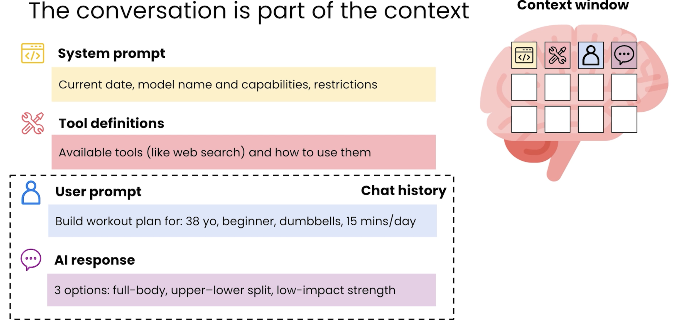
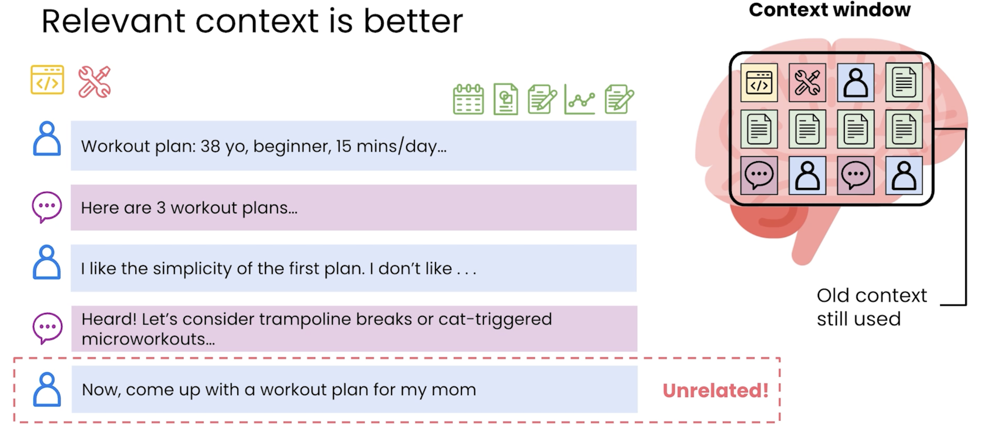

# 📘 07 上下文 (Context)

> 来源：Andrew Ng | Module 2: AI as a Thought Partner | 课时 2/7 | ~6 分钟

---

## 🧠 核心概念总览

- [*知识点1: 人类 vs AI 的上下文窗口*](#id1)
- [*知识点2: Context 的基本组成部分*](#id2)
- [*知识点3: 上下文越相关越好*](#id3)

---

## ✅ 知识点1: 人类 vs AI 的上下文窗口
**AI 的「工作记忆」容量是人类的上万倍**

- **对比**
  | | 人类工作记忆 | AI 上下文窗口 |
  |------|-----------|------------|
  | 容量 | 约 7 件事（经典认知心理学结论） |750,000 字符（4-5本哈利波特） |
  | 处理方式 | 串行，逐条阅读 | 并行，全量吸收 |

- **context 的定义**：
  - Context 指的是模型用来生成定制回复的所有文本和文件
  - 一个值得信任的顾问，**所需要的所有的信息**进行思考推理并给出一个合理有价值的答案
  
  

>💡 AI 的超级上下文窗口是一个**被严重低估的能力**——大多数人只扔一两句话进去，等于开跑车去买菜
>⚠️ 上下文窗口大 ≠ 理解深度无限——信息量太大时 AI 仍可能忽略中间部分的细节

---

## ✅ 知识点2: context 的基本组成部分

**Context 也有结构**

- **组成结构**：
  1. 系统提示词（system prompt）
  2. 工具定义（Tool definition）:工具描述，以及如何使用他们的说明，通常包含 MCP 等
  3. 用户提示词（user prompt）
  4. 人工智能回复（AI response）
  

- **context 的嵌套**：
  - 用户提示词语 + 人工智能回复 = 历史聊天记录
  - 历史聊天记录会被重新塞到上下文中 

---

## ✅ 知识点3: 上下文越相关越好

**值得注意的是...**

- **对于一个长上下文来说**
  - 一次上传几百页 PDF
  - 混合不同格式：合同文本 + 截图 + 语音转录 + 表格数据
  - 在同一个对话中维护多轮上下文——AI 记得之前说过的一切

- **但是如果**
  - **话题突变**（「现在帮我妈制定健身计划」）**会让之前积累的上下文失去相关性**
  - AI 会被上下文分心，然后极有可能生成质量更差的结果
  
- **重新开始会话**：这就是为什么我们换一个 topic 后，最好重新开始一个会话

- **解决相关上下文丢失的方法**：赋予模型访问电脑权限，让其探索并仅在需要时调入相关文件

>💡 本质上是去避免无关上下文文本

---

## 🔑 本课核心要点

1. AI 的上下文窗口能容纳数十万词——远超人类的 7 件事
2. 利用这个能力：把相关文档**全部**扔进去，让 AI 读完全部材料再回答
3. 关键 prompt 短语：`read everything` + `think really hard`
4. 最重要信息放开头或结尾，避免被长文本中间稀释

---
