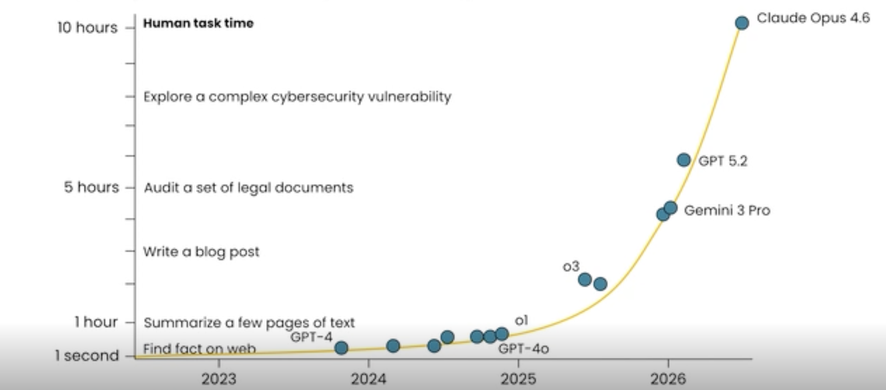
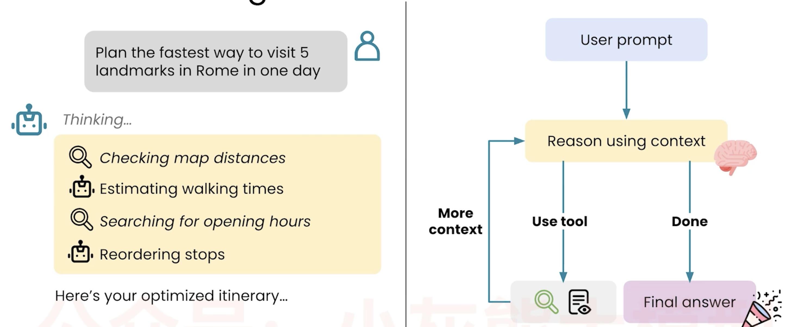

# 📘 09 用 AI 推理 (Reasoning with AI)

> 来源：Andrew Ng | Module 2: AI as a Thought Partner | 课时 4/7 | ~8 分钟

---

## 🧠 核心概念总览

- [*知识点1: 「think step-by-step」已死——推理范式的升级*](#id1)
- [*知识点2: AI 能力的增长*](#id2)
- [*知识点3: AI 的推理循环*](#id3)
- [*知识点4: 如何触发延长推理*](#id4)
- [*知识点5: 给 AI 难一点的任务——创业策划案例*](#id5)


---

<a id="id1"></a>
## ✅ 知识点1: 「think step-by-step」已死——推理范式的升级

**随着 AI 的进步它可以像一个研究员一样长时间深度推理复杂问题，而不是仅仅预测下一个词**

- **2023-2024 年的旧建议**
    ```
    think step-by-step（逐步思考）
    ```
    → 适用于简单任务，如「strawberry 里有几个 R？」

- **现在的做法**
    ```
    think hard（认真思考）
    think really hard about this（认真深入思考）
    ultrathink（超级思考——模型理解的关键词）
    ```


- **为什么变化了**
    - 旧模型需要被显式引导才能不错过简单步骤
    - 新模型自身推理能力大幅增强，不再需要手把手教思考步骤
    - 模型现在可以自己决定推理策略——可能比「逐步」更复杂、更高效

> 💡 核心转变：「告诉 AI 怎么思考」→「告诉 AI 花更多资源去思考」
> 📋 `Ultrathink` 是一个已知的触发词，模型识别后会显著延长推理时间

---

<a id="id2"></a>
## ✅ 知识点2: AI 能力的增长

**还是因为能力越来越强...**

- **研究框架**：横轴 = 人类完成该任务所需时间，纵轴 = AI 成功率

    | 人类耗时 | AI 达标时间 | 例子 |
    |---------|-----------|------|
    | 几秒 | 早期就能做到 | 查一个事实 |
    | ~1 小时 | ~2024 年 | 总结几页文档 |
    | ~2 小时 | ~2024-2025 年 | 写一篇博客 |
    | **数小时** | **2025 年** | 审计法律文件、探索网络安全漏洞 |

    


> 💡 AI 的推理时间门槛在逐年上移——2025 年的模型已经能在数小时级的人类任务上取得不错的成功率


---

<a id="id3"></a>
## ✅ 知识点3: AI 的推理循环


**从一个例子来看 AI 如何推理的**
- **Prompt**
    ```
    Plan the fastest way to visit five landmarks in Rome in one day.
    计划一天内参观罗马五个地标的最快路线。
    ```

- **AI 的推理循环**

    ```
    接收 prompt + 上下文
        ↓
    思考/推理
        ↓
    ┌─→ 答案准备好了？ → 输出最终答案
    │       │
    │     还需要更多信息？
    │       ↓
    │   使用工具（网络搜索、读文件）
    │       ↓
    │   获取额外上下文
    │       ↓
    └── 返回，重新推理
    ```

- **具体执行**
    

> 💡 这是 Agentic AI 的标准推理循环：**推理 → 发现缺口 → 获取信息 → 继续推理**——像人类研究员一样工作

---

<a id="id4"></a>
## ✅ 知识点4: 如何触发延长推理

**触发有多种方式**
- **三种方法**：

| 方法 | 操作 |
|------|------|
| **界面选项** | 使用聊天界面中的「thinking/推理」模式开关 |
| **Prompt 指令** | 在 prompt 中写 `think really hard about this` |
| **关键词** | 使用 `ultrathink` ——模型理解的触发词 |

- 模型收到这些信号后，可能思考 **数十秒、数分钟，甚至超过 10 分钟**。

---

<a id="id5"></a>
## ✅ 知识点5: 给 AI 难一点的任务——创业策划案例

**Andrew Ng 的建议**
> "给 AI 一个人类专家需要足够多上下文才能完成的任务，看看它能做到什么程度。"

**案例：四人生存期初创公司的 12 个月规划**
```
（给 AI 大量关于你的创业项目的上下文：产品、市场、团队、资金）
请为一家资金有限的四人初创公司设计一份 12 个月的行动计划。
```

**四个核心建议**

| # | 建议 |
|---|------|
| 1 | **用最好的模型**——6-12 个月前的老模型和现在差距巨大 |
| 2 | **给足上下文**——人类专家完成任务需要多少信息，就给 AI 多少 |
| 3 | **尝试难任务**——不要只让 AI 做简单的事，你可能会惊讶 |
| 4 | **开启思考模式**——界面开关或 prompt 中写 `think hard` |

---

## 🔑 本课核心要点

1. 「think step-by-step」已过时——现在告诉 AI「think hard」就够了
2. AI 的推理是循环式的：思考 → 发现缺口 → 获取信息 → 继续思考
3. 2025 年的 AI 可以在数小时级的人类任务上取得不错成功率
4. 给 AI 难的、真实的任务——配上足够上下文和思考时间


---
